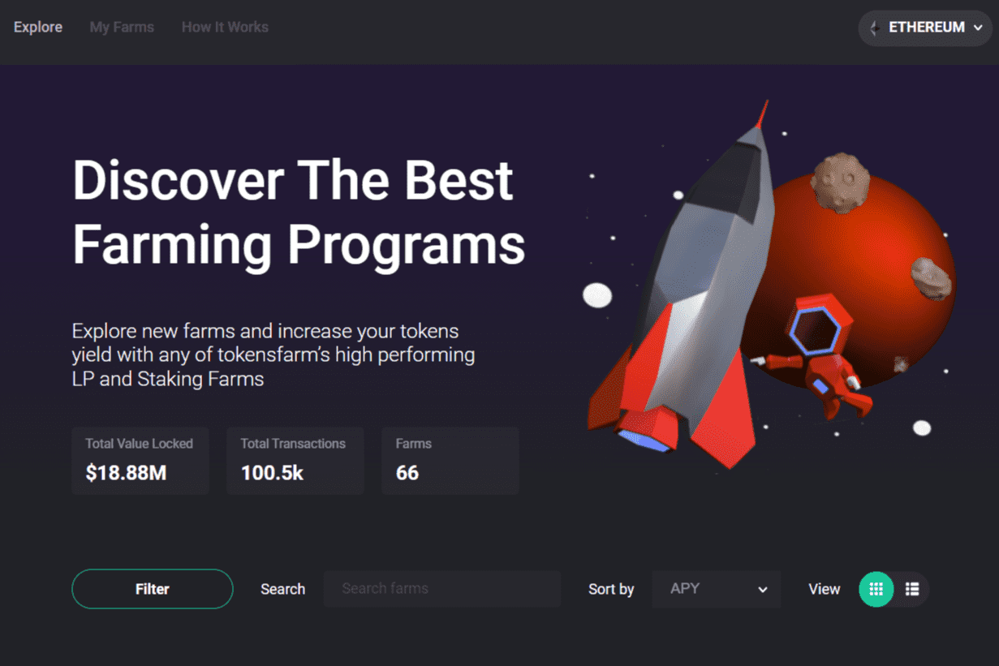

# Tokensfarm

TokensFarm 是一家多链农场即服务提供商，提供可在几分钟内上线的现成农场。它使加密货币持有者能够拥有一站式商店，以赚取质押代币的收益。同时，它允许项目激励流动性并增强代币和项目的稳定性，同时获得约 10 万月度独立用户的曝光。
我们目前的产品如下：
- 质押农场：允许项目轻松设置质押农场，奖励社区在动态 APY 合约上锁定代币。
- LP 农场：激励社区增加流动性，提供农场，用户可以在其中质押在 DEX 上提供流动性后收到的 LP 代币。
- 归属合约：允许项目根据预定义的归属规则和发布时间表自动将代币从智能合约分配到白名单地址。
TokensFarm 帮助项目充分利用动态 APY、经审计的智能合约、多 DEX 功能以及为每个项目定制的 UI 设计。支持来自但不限于以下 DEX 的所有 EVM 和 LP 代币：PancakeSwap、UniSwap、QuickSwap、BakerySwap、Pangolin 等等
- 
