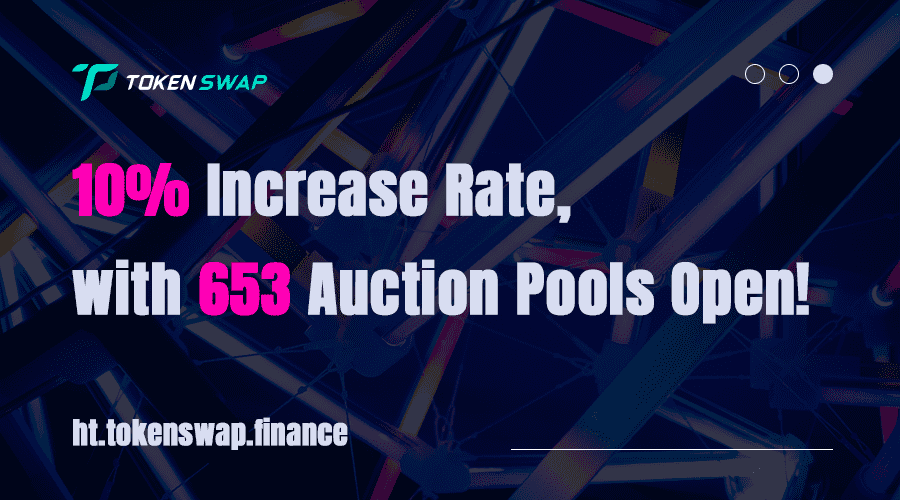

# TokenSwap

什么是代币交换？
TokenSwap 是一个去中心化的代币拍卖平台。 我们希望解决 Token 资产预售过程中的一系列问题，如拍卖不公开、手续费过高、中心化平台干扰、Token 拍卖受限等问题。

flovtec 正在整个加密行业建立强大的合作伙伴网络。我们努力与每个合作伙伴建立互惠互利的关系，并将我们的服务提供给合作伙伴的生态系统。

去中心化代币拍卖协议 | $TOP
支持#HuobiECOChain 和#Polkadot 系统上的项目筹款。

