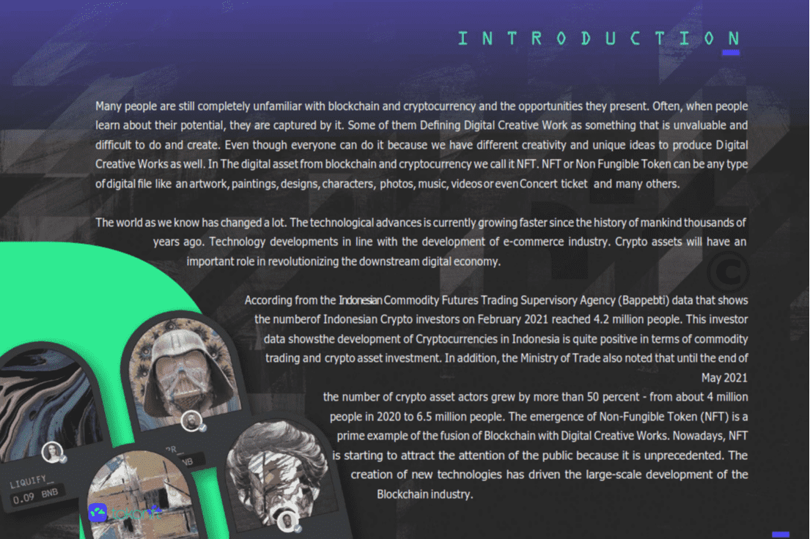

# Tokonft

什么是 Tokonft？
TokoNFT 瞄准全球市场，在区块链网络上为创意经济艺术家服务更广阔的市场。 区块链为数据存储和价值交易提供了一个分布式和安全的系统。 它的应用在多个领域如雨后春笋般涌现。

更轻松、更便宜地创建 NFT。TokoNFT 为创作者提供 NFT 创作平台和 NFT 市场，费用非常实惠，并通过空闲游戏池奖励每月奖励计划，这可以使 NFT 创作者和收藏家的生态系统受益。

TokoNFT 提供了一个名为 $TKN 的实用代币。$TKN 可用于 TokoNFT 生态系统以支持市场上的各种功能。

TokoNFT 支持各种项目的区块链生态系统，并邀请每个项目的创建者能够通过 NFT Launchpad 程序启动他们的 NFT 项目。TokoNFT 提供了一个自定义池，附属项目可以使用它为其社区启动 NFT，也可以在 TokoNFT 中进行交易

