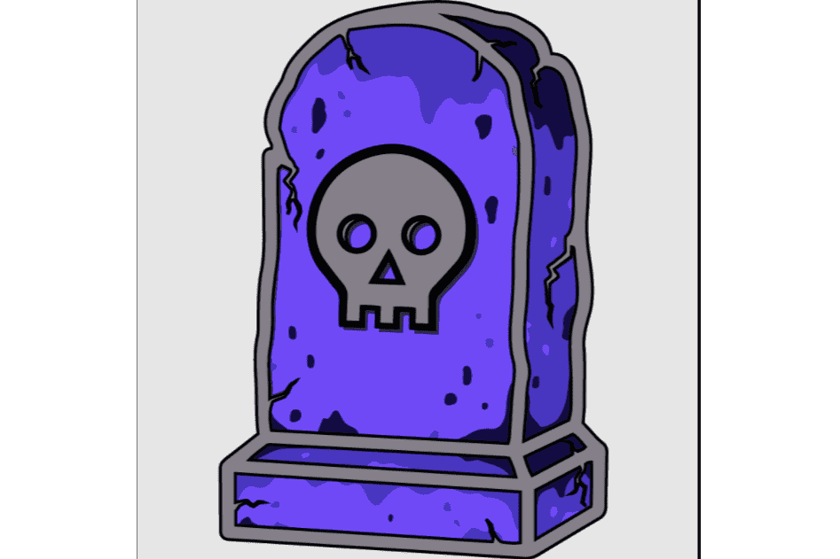

# Tomb Finance

什么是坟墓金融？
古墓算法代币是第一个项目，也是生态系统的基础，将为代币持有者带来实用性和价值。

由 Tomb.finance 团队设计，作为 OPERA Fantom 上第一个与 FTM 而不是稳定币挂钩的算法代币。它围绕着一种解决方案工作，该解决方案可以调整代币供应，以使代币本身的价格朝着目标价格的方向上下移动，从而为价格带来可编程性和稳定性。

受 Basis 最初想法及其前身改进（bDollar 和汤）的启发，Tomb 是一个多代币协议，由以下代币组成：Tomb (TOMB)、Tomb Shares (TSHARE) 和 Tomb Bonds (TBOND)。

首先，它不是与稳定币挂钩，而是与 FTM 挂钩。为什么？因为我们相信 OPERA Fantom 网络的潜力，因此我们正试图通过跟随其价格并添加更多用例来为 FTM 代币增加更多价值。

这就是我们的第二个原因，用例。我们的团队成员长期以来一直是算法硬币的支持者，我们都同意他们都在一件事上失败的事实：用例。人们需要持有挂钩令牌，而这只能通过新功能来实现。

