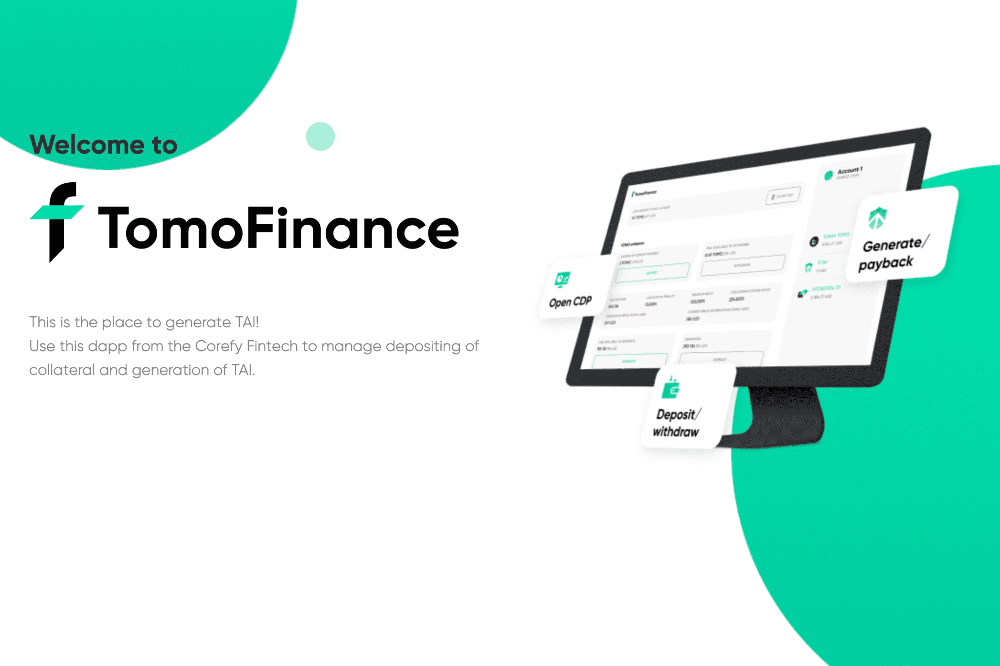

# TOMOFINANCE

TomoFinance 是生成 TAI（TomoChain 上的稳定币）的门户。 使用 TomoFinance，您可以管理您的抵押品以及 TAI 的生成。
TomoFinance 作为 TomoChain 区块链上的去中心化金融应用程序，由许多智能合约管理。

TomoFinance 是一个基于 TomoChain 的 Defi 项目，于 2021 年第一季度启动
Corefy Fintech Co., Ltd. 与区块链开发公司 BACOOR INC. 合作研发一个联合发行去中心化稳定币“TAI”的平台。BACOOR INC. 还处理与 HB Wallet 和 Tomochain 联合开发的 Pantagraph。

我们将采用 Tomochain 作为主链，历史上首次发行同链稳定币，构建 Tomochain DeFi 的基础设施。

TomoChain 为以太坊区块链和其他区块链平台的可扩展性问题提供解决方案。它与 EVM 高度兼容，可以使用与以太坊相同的地址进行管理。

交易手续费为 ETH 的 1/18000，交易速度是 ETH 的 80 倍，势不可挡。它具有 150 个主节点架构，包括权益证明投票 (POSV) 共识和即时交易确认。

您还可以通过 TomoBridge 将 BTC 和 ETH 等其他区块链的加密资产打包到 Tomochain 的令牌标准“TRC-21”中，从而获得无边界的 DeFi 服务。

