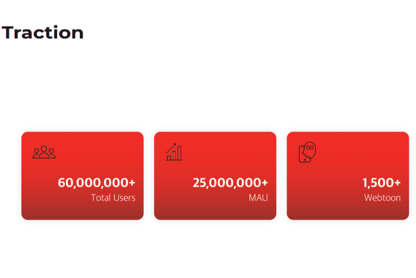

# TooNFT

什么是ToonNFT？
TooNFT 致力于通过实施基于区块链技术的透明补偿系统来建立去中心化的 WebToon 市场。 通过利用智能合约和 NFT 等尖端技术进步，TooNFT 团队发现了一个机会，可以消除中间商的角色，并创建一个具有透明度、公平性和关注创作者和消费者等特点的去中心化 WebToon 生态系统。

TooNFT 是一个前所未有的基于区块链的平台，它将通过创建创新的下一代 NFT 生态系统来彻底改变 WebToon 行业。

TooNFT 的核心功能是

在没有中间人的情况下指导作家、读者和投资者之间的交流

为投资者和创作者创建透明的薪酬体系

将 WebToon 创作转化为可交易的 NFT

