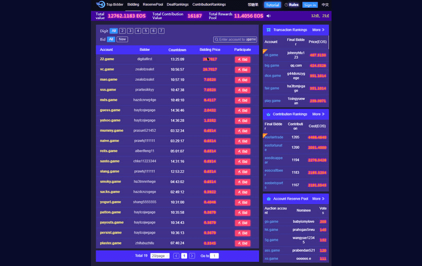

# Top Bidder

什么是最高出价者？
Top Bidder 是一款用于高级 EOS 账户拍卖的 dapp。 您可以对以game、ex、net和pra为后缀的账户出价。 例如，您可以出价“cool.game”、“fast.ex”或“batte.net”作为您的 EOS 账户。 每个账户从 0.05 EOS 开始拍卖，每次出价增加 10% 的价格。 在拍卖期间，当另一个出价超过您的价格时，您可以获得 75% 的利润。 推荐人的其他 5% 利润和 20% 的利润进入奖池。 当账户超过 12/24 小时没有以更高的价格出价时，最高出价者将获得创建该账户的权限，并获得奖池分红的因素。 您每天可以在储备池中提交或投票 10 个新帐户。 当一个账户完成拍卖后，储备池中投票最多的将自动开始拍卖

