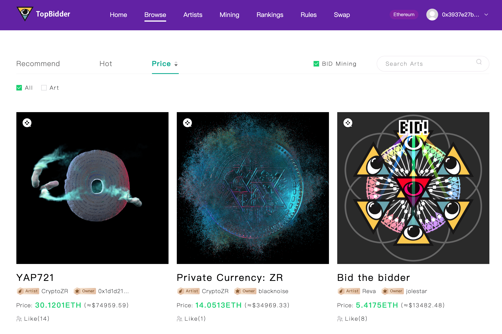

# TopBidder

什么是TopBidder？
TopBidder 是一种基于 ERC721 标准的激进拍卖协议。 它采用激进市场的理论，并实现了加密 vickery commons（rNFT）的生产和拍卖机制。 每个 rNFT 都有一个带有联合曲线模型的自我定价机制

当投标人以更高的价格出价获得 NFT 时，艺术家可以获得 50% 的溢价。 所以他们成为了他们艺术品的股东。 而前 NFT 所有者可以赚取 30% 的保费作为补贴

投标人在投标某些艺术品时可以获得$BID代币

