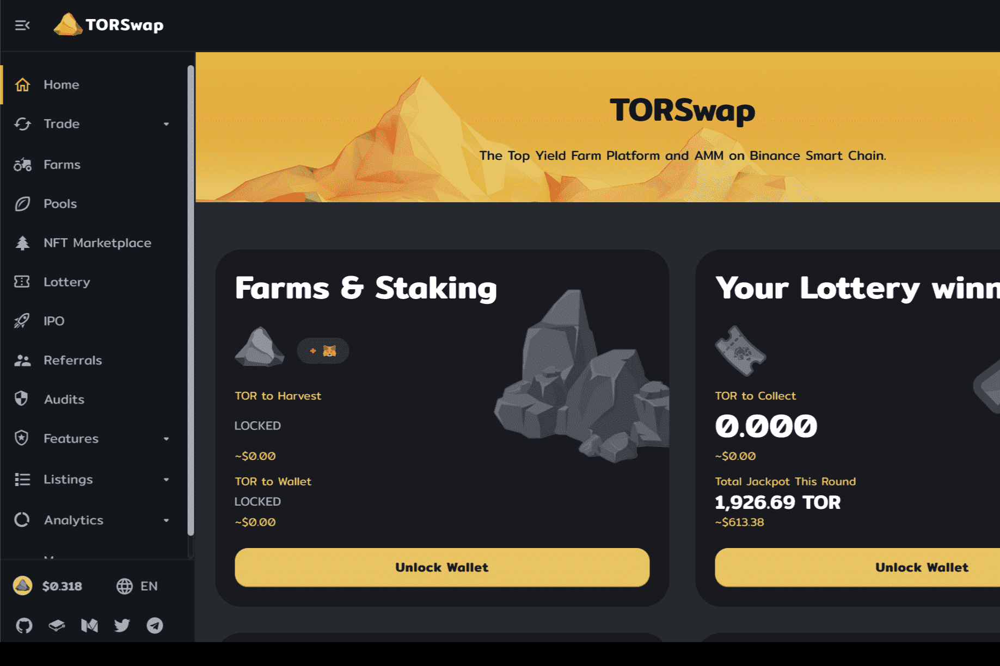

# TOR Swap

TOR Swap 是运行在币安智能链上的收益农场平台和 AMM 去中心化交易所，具有许多独特和创造性的功能，可让您赚取

什么是 TOR 交换？币安智能链上的TOR金融平台包括：

AMM DEX 单产农业和质押 自动复合 跨链农业 彩票 IFO 保险库
数字资产和艺术的 NFT 市场

AMM 的工作方式类似于订单簿交换，因为存在交易对，例如 ETH/DAI。但是，您不需要另一方的交易对手（另一个交易者）来进行交易。相反，您与为您“创造”市场的智能合约进行交互。

在像Binance DEX这样的去中心化交易所中，交易直接发生在用户钱包之间。如果您在 Binance DEX 上以 BUSD 出售 BNB，那么交易的另一端会有其他人用他们的 BUSD 购买 BNB。我们可以将其称为点对点 (P2P) 交易。

