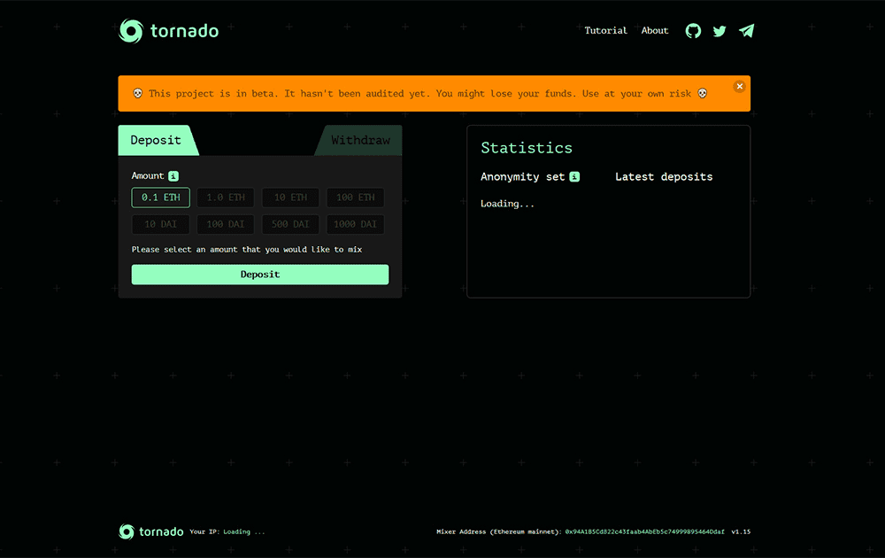

# Tornado Cash

什么是龙卷风现金？
Tornado.cash 帮助您恢复您的隐私。 您可以使用它以隐藏您的发送地址的方式将 Ether 发送到任何地址。 它使用零知识证明来做到这一点。 您可以使用此应用程序将一些 ETH 存入非托管智能合约，然后轻松生成您已执行所述存款的证明，而无需透露您的原始地址。 然后，该应用程序会将这个证明发送给运营商，运营商会将其提交给智能合约，智能合约又会将 ETH 发送给所需的接收者，并向运营商偿还一小笔费用。

