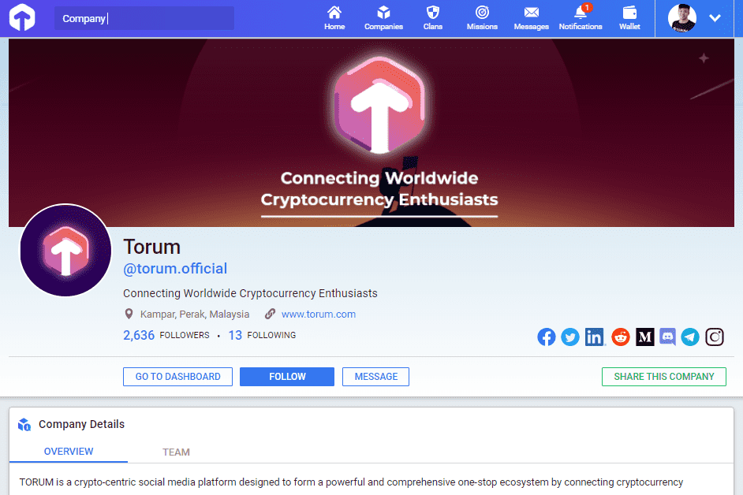

# Torum

什么是托鲁姆？
TORUM 是一个专为全球加密货币用户设计的社交媒体平台。 Torum 连接加密货币成瘾者和爱好者，为行业形成一站式加密生态系统。

在众多 VC 的支持下，Torum 现在是来自世界各个角落的加密货币爱好者的热门聚会场所，包括美国、加拿大、瑞士、英国、新加坡、澳大利亚等。

Torum 是专门为连接加密货币用户而设计的全球最大的 SocialFi 生态系统（Social + NFT + DeFi + Metaverse）。

Web3.0 生态系统建立在一个社交媒体平台之上，再加上面向 DeFi 玩家的收益农业平台、面向加密艺术家的 NFT 市场和面向元界爱好者的 Avatar NFT。

