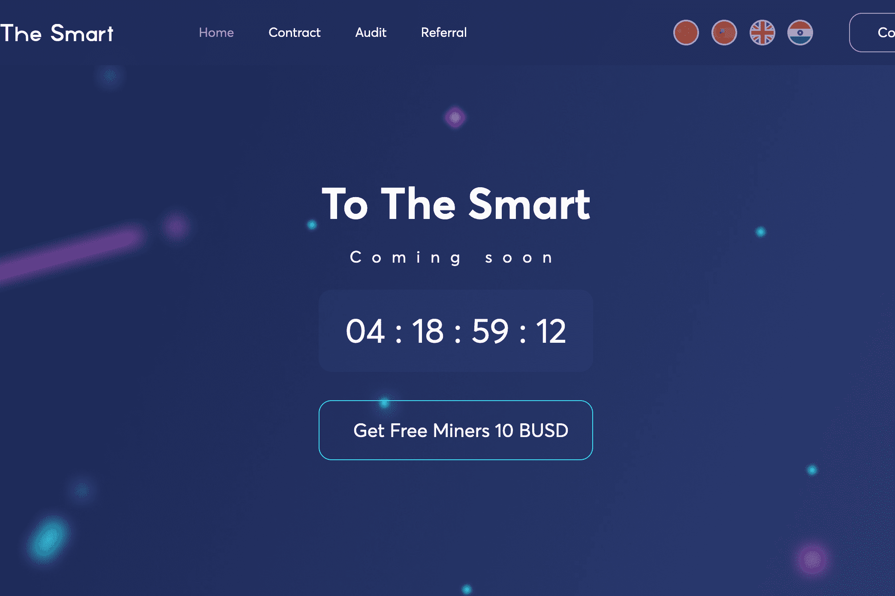

# ToTheSmart

玩赚取建立在币安智能链区块链上的矿场。购买矿工，开采 MineToken，并将其兑换成 BUSD 或再投资于您的农场，增加您的每日收入。参与 ToTheSmart 大使计划，从每一次购买矿机以及从 7 代深度追随者的收入中赚取收入。
经济
购买矿工，每个矿工每秒会为您带来 1 个 MineToken。出售稳定币 Busd 的代币或再投资于购买矿工以赚取更多收益。
您每天可以获得矿工当前价值的 5%，您可以将其再投资于购买或出售矿工。
免费矿工
每个会员都可以免费获得 10 个 Busd 的矿工，并查看系统如何工作，但在至少购买 50 个 Busd 矿工之前，ReMiners 和 Windrow 功能将无法使用。
50 Busd + 10 Busd = 60 Busd（矿工）
反套件功能
这类矿工的问题是，在项目一开始就登录的用户，由于合约余额从零快速增长到第一百万，获得了超额利润。
我们已经解决了这个问题，并通过一个公式使我们的经济更加平衡，该公式将把 Busd 添加到当前余额中，直到合约余额超过 500,000 Busd 标记。
时间池
得益于时间池机制，您将不再担心成为最后一个购买矿机的玩家。这个怎么运作：
每次购买矿工的 1% 以及每次销售 MineToken 的 1% 都会转移到时间池智能合约中。如果您购买了矿机，之后 60 分钟内没有人购买，那么整个 Time Pool 余额将自动转入您的钱包地址。
成为最后一名从未如此有利可图！

