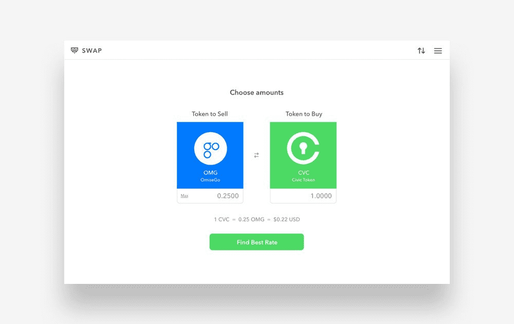

# Totle Swap

什么是Totle Swap？
Totle 聚合了以太坊上的所有去中心化交易场所和自动化做市商。 用户在使用 Totle 的智能订单路由技术交换代币时会自动获得最优惠的价格。 今天在 totle.exchange 交换代币！

可靠的 DeFi 聚合
Totle 将去中心化交易所和合成资产提供商聚合成一套工具，可以轻松以最优惠的价格获得 DeFi 资产的深度流动性。

以最优惠的价格交换

DeFi 聚合
Totle 连接到顶级去中心化交易所和合成资产提供商。

当您通过 Totle 执行掉期交易时，您的订单将被发送到市场上提供最优惠价格的来源。

