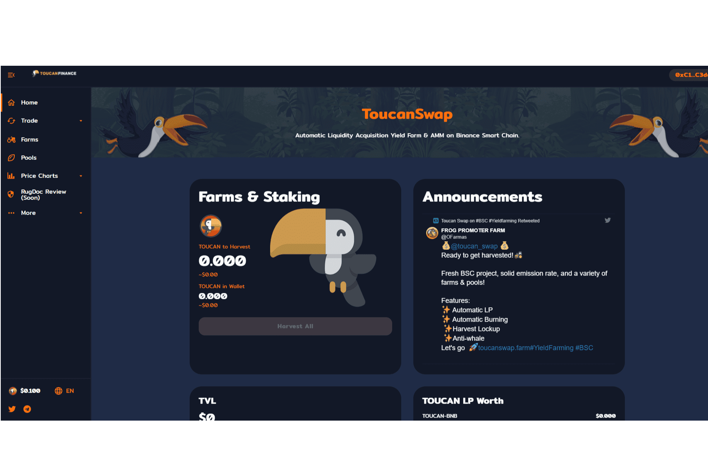

# Toucan Swap

什么是巨嘴鸟交换？
#BSC 上的新农业巨嘴鸟交换

收获锁  准备收获！   新鲜BSC项目，  固体排放率，  以及各种农场和游泳池！

特征：

自动唱片    自动刻录   收获锁定    反鲸我们走吧

Toucan 的基础设施为 Web3 带来了可编程碳，释放了其再生经济的潜力。

toucan 碳桥是一个单向的桥梁：碳信用可以上链，但不能走另一条路。原因很简单：我们希望防止重复计算并重视公共区块链的确定性。这就是为什么碳桥的用户需要在将它们上链之前*退出源注册表中的信用。*通过这种方式，我们可以保证碳代币是唯一的，并且在链上*燃烧*碳代币相当于淘汰碳信用额，并且不需要中心化实体退出碳登记处中的“现实世界资产*”* . 毕竟，与任何集中式分类账系统相比，公共区块链可能是一种更安全、更透明的碳资产跟踪方式🤷

