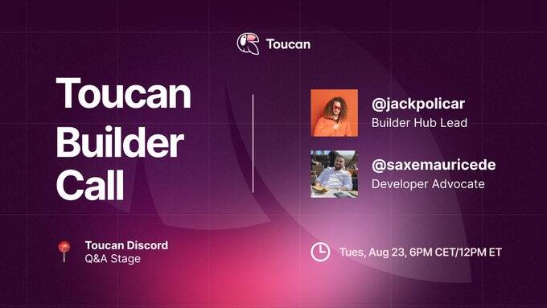

# Toucan

什么是巨嘴鸟？
碳 + DeFi

我们将碳作为新的货币乐高积木引入 Web3。 启动一个开放和去中心化的气候金融生态系统。

Toucan Bridge 将自愿碳市场连接到 Web3。对于桥接的每个信用额度，都会存入一个代币化 CO2 代币。TCO2 是半可替代的，保留有价值的元数据，并且可以汇集以实现最大流动性。

连接到 TCO2 的碳信用共享标准化数据，无论来源登记处如何。这打破了市场孤岛，同时提高了可访问性和透明度

合格的 TCO2 可以存入碳池，以换取可替代的参考池代币（例如 BCT）。这些高流动性资产可以随时赎回 TCO2。

