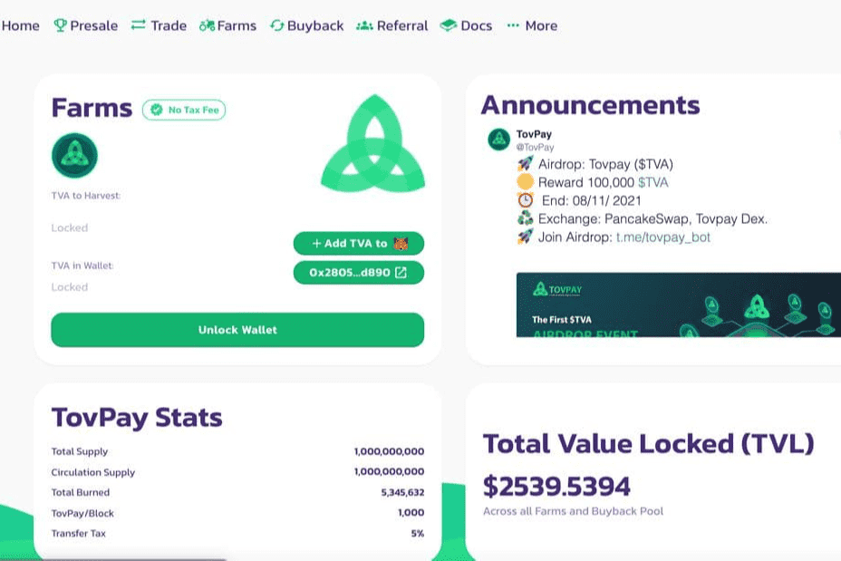

# Tovpay

Tovpay 是一个去中心化的金融和支付。 通过以下产品为新的数字经济提供基础构建层：钱包、支付、交易所、加密货币/法定货币、DEX、锁定流动性和锁定令牌并将加密货币连接到现实世界。

您可以在我们网站的 Swap 界面 (http://app.tovpay.io) 或 PancakeSwap 上购买 $TVA
1.点击解锁钱包并批准
3.点击添加TVA到钱包
4.您可以自定义设置Slippage Tolerance 2%

5选择您想要的金额点击交换和确认交换。

