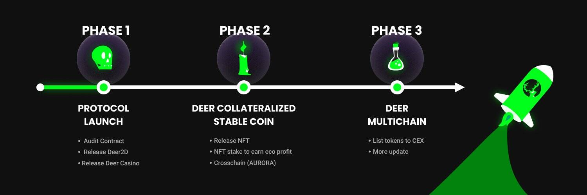

# ToxicDeer Finance

什么是毒鹿金融？
ToxicDeer (DEER) 是一个运行在 Cronos 链上的抗通缩和抗通胀的加密项目。 它从 BasisCash 及其前身 Pegasus、Soup 和 Tomb Finance 中汲取灵感。

我们希望通过将 DEER 与 USDC 挂钩来支持他们的协议，从而为 USDC 提供新的用例，并增加 ToxicDeer 在 Cronos 生态系统中的流动性。

因此，让我们自己接触 USDC 也意味着让我们接触它最近的成功。 作为强大的 USDC 支持者，我们可以通过在 ToxicDeer Finance 中为其 USDC LP 提供空间来吸引来自 USDC 的投资者。 是的，USDC 是 DEER，DEER 是 USDC。

