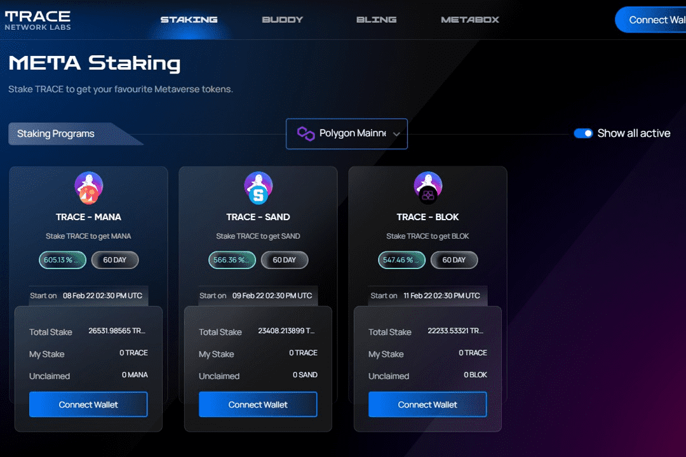

# Trace Network Labs

什么是 Trace Network Labs？
Trace Network Labs 正在由 NFT 和数字时尚提供支持的 Metaverses 中为他们提供真实的元双胞胎（数字化身）和生活方式。 Trace Network Lab 的愿景是成为生活方式品牌的事实上的门户，以推出一套新的限量版生活方式和时尚产品，这些产品专为我们真实的数字化身打造，以跨越多个连锁店和元界。

创建您的个性化头像，以便在各种虚拟世界中工作、娱乐和社交。您的好友头像是按照允许跨链移动的标准制作的，以允许您进入不同的元节并进行交互。

在 BLING 市场购买和出售 Lifestyle Product NFT。将最好的数字生活方式产品、配件添加到您的数字衣橱中，可以在各种元宇宙中穿在您的好友头像上。

NDK使品牌能够创建独特的数字产品的新类别，可用于与各种web2.0 web3.0平台交换产品细节。

Trace Network Labs 使品牌能够使用绑定到核心操作系统的 SDK 包来探索 Web 3.0 产品和服务。

