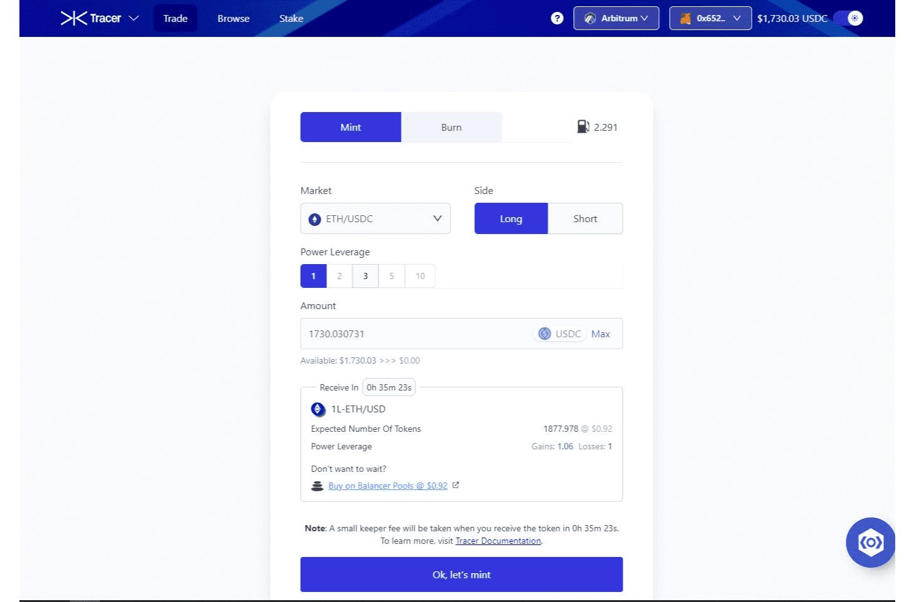

# Tracer DAO

什么是 Tracer DAO？
Tracer 是 Arbitrum 上用于衍生品的开源智能合约协议。 Tracer 能够让任何人从 Tracer Factory 模板部署衍生品市场，以管理他们的数字和现实世界金融风险。

推出的第一个衍生品市场是一个新的原语——Tracer Perpetual Pools。 没有保证金。 没有清算。 DeFi 经济的完全可替代代币。 您现在可以获得零清算风险、对中心化方零信任和杠杆设置零限制的任何资产的低成本杠杆敞口。

TCR 是 Tracer DAO 的治理代币。 TCR 授予其持有者参与协议治理和对提案进行投票的权利。 提案是社区驱动的，可能包括： 研究参与、咨询角色、协议升级、财务管理、软件开发、媒体合作、安全审计以及许多其他重要职责。

