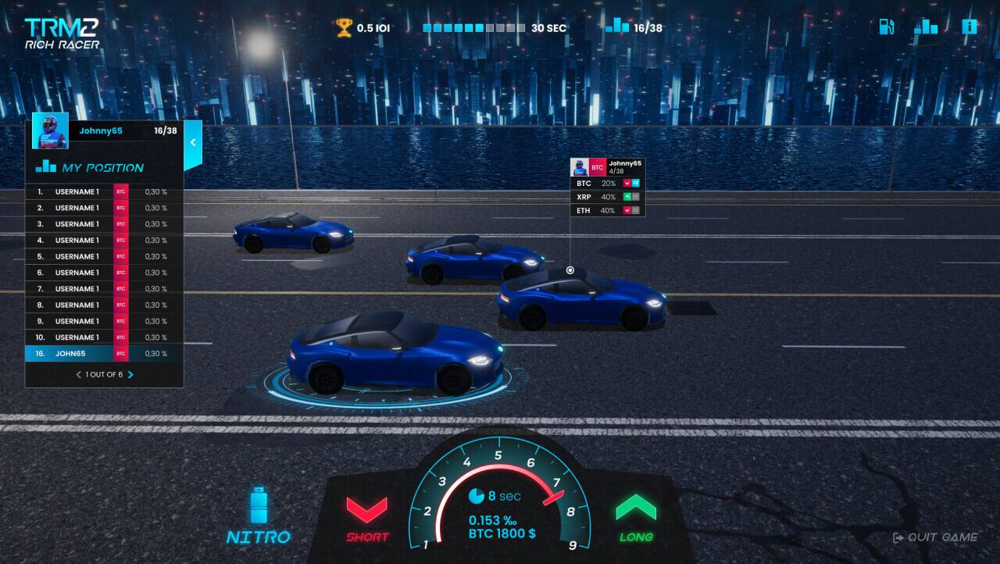

# Trade Race Manager 2: Rich Racer

Trade Race Manager 2 (TRM 2) 代表了完全以 3D 构建的下一代交易模拟器，具有赛车世界中的游戏和赚钱模型。用你独特的 NFT 超级跑车与世界各地的现场玩家竞争。与朋友组队并调整您的交易策略以获得最大收益！
游戏行业的革命
NFT - 游戏中有超过 40 种独特的性能汽车，可让您自由玩耍和赚钱。以 NFT 的形式购买游戏内资产并增加您的每日奖金。游戏包括四种不同的 NFT。汽车，船，化身和轨道。不可替代的代币是游戏的核心组成部分。您可以在游戏中获得显着优势，但也可以根据需要使用 NFT。
为您的汽车加油
TRM 2 是一款赛车 NFT 游戏，您选择的加密货币的性能将推动赛车的进步。新的燃油系统对新玩家很友好，同时仍然为有经验的玩家提供了高级选项。加油系统是帮助您制定赛车策略的工具。有两种模式可供选择。简单而高级，在简单模式下，您可以选择一种预先制定的策略，在高级模式下，您可以根据自己的选择为汽车加油。
加入锦标赛
锦标赛是最大的活动，也仅限于 NFT 所有者。全球各地每天有 4 场比赛。获胜者将获得每场锦标赛的奖金池。您可以乘坐汽车或船只参加比赛。
探索赛道
游戏包括来自欧洲、俄罗斯甚至南极洲等世界各地的不同设置的 5 条详细赛道。不知道买什么车？进入试车模式，您可以在赛道上尝试游戏中的所有汽车，尽情享受狂野的乐趣！

