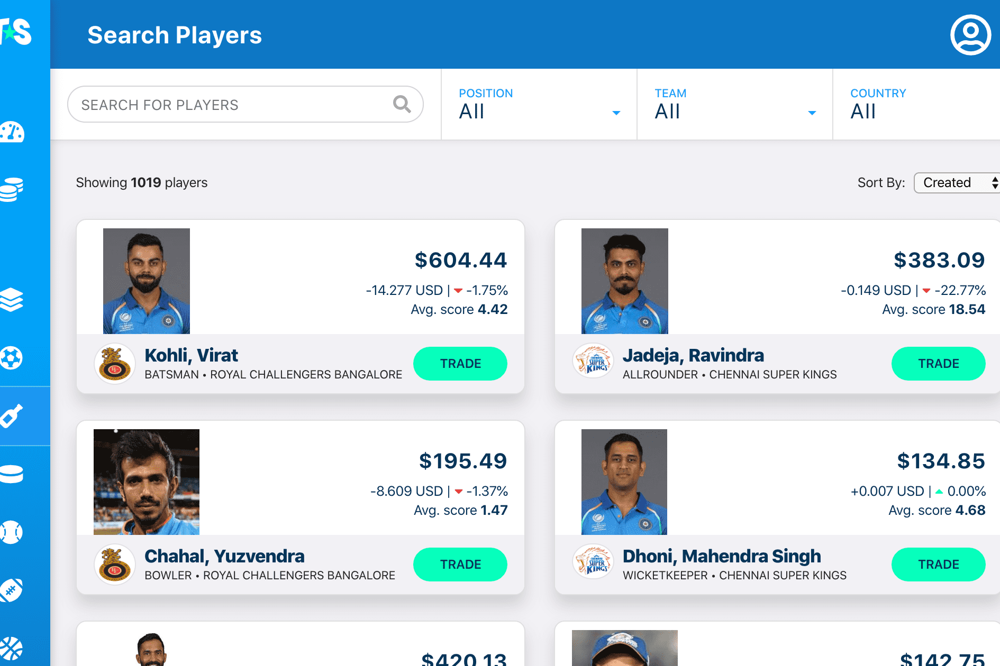

# TradeStars

什么是贸易之星？
TradeStars 是一个由以太坊区块链提供支持的梦幻体育平台，用户可以在其中创建和交易代表真实体育表演的数字资产。 一种新的方式，人们可以表达他们对体育的热情，相互竞争，并展示“他们的体育知识价值多少”我们的愿景是为梦幻体育行业提供真正的数字所有权、透明度、流动性和去中心化，以及 ，在这项努力中，人们可以通过新的方式在彼此之间以及与他们最喜欢的运动队和运动员之间交流和表达他们对运动的热情。

