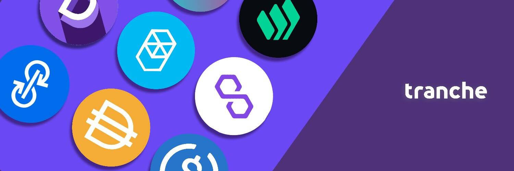

# Tranche Finance

什么是分批融资？
Tranche 是一种去中心化的风险管理协议。 该协议与任何应计利息代币（例如 Compound 的 cTokens 和 AAVE 的 aTokens）集成，以创建两种新的计息工具，一种具有固定利率的 A 部分，另一种具有可变利率的 B 部分。

⁣Tranche 与类似的 Dapp 有何不同？

Tranche 为去中心化网络重新发明了债务资历。 与其他风险管理协议不同，Tranche 提供无时代且完全永久的去风险资产。

⁣什么是切片？

Tranche Token 或 SLICE 是协议的治理代币。 SLICE 持有者可以对协议参数和其他治理问题进行投票，以及质押他们的 SLICE 或 SLICE-LP 代币以获得奖励。 SLICE 还通过平台使用来增加价值。 该协议以 USDT、Dai 和 ETH 收取费用，然后通过 UniSwap 池将应计费用兑换成 SLICE 代币。

