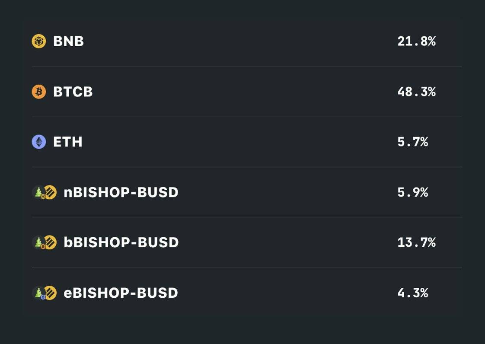

# Tranchess Protocol

什么是传输协议？
Tranchess 是一种提高收益的资产跟踪器，具有多种风险回报解决方案。 Tranchess 在跟踪特定标的资产的单一主要基金中提供了不同的风险/回报矩阵。 Tranchess 这个名字的灵感来自国际象棋游戏，以及法语单词“Tranche”，它通常与适合不同风险偏好的不同类别投资者的 tranche 基金相关联。 Tranchess 于 2021 年 6 月 24 日推出。

主基金，又名代币 Queen，跟踪特定的基础资产，可以平均分成 2 个子基金。我们有目的地选择 BTC 作为第一个跟踪的加密资产。同时，它还共享许多流行的 DeFi 功能，例如：单一资产收益耕作、借贷、交易等。

Tranches提供：

提高收益回报而不会招致无常损失
低成本杠杆持仓，无强制平仓
女王持有人的零锁定期
使用 TWAP（时间加权平均价格）预防 Oracle 攻击

