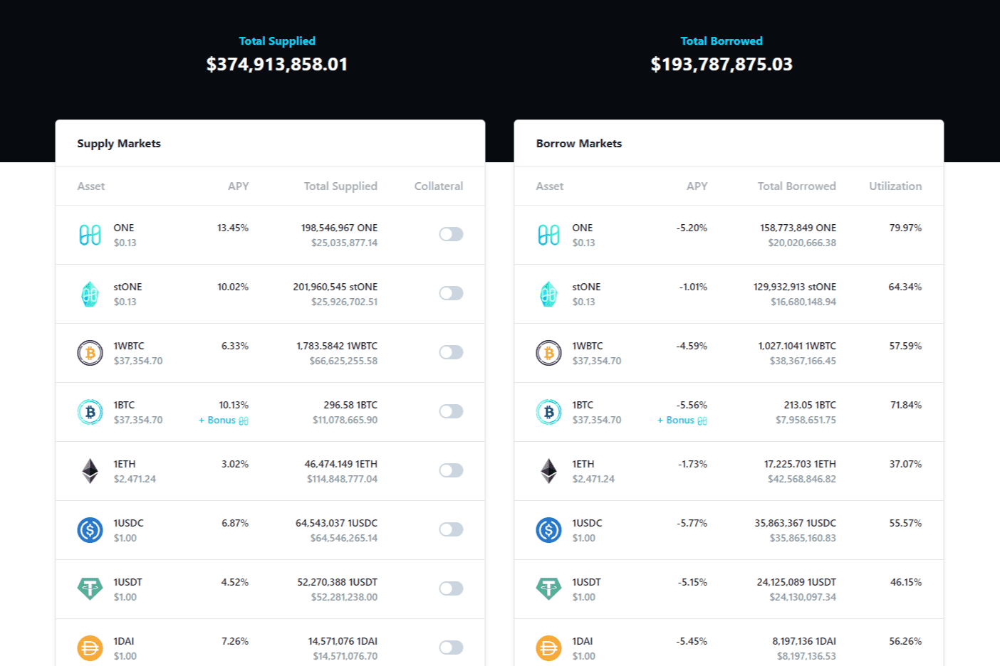

# Tranquil Finance

什么是平安金融？
Tranquil Finance 是 Harmony ONE 区块链上的算法货币市场协议和 DEX。 它允许用户交换、供应和借入资产，同时以完全无需许可和去中心化的方式接收或支付利息。 借贷利息根据市场需求设定，贷款超额抵押以保证偿付能力。

Tranquil Finance 的愿景是成为 Harmony 上每个主要 DeFI 原语的首要平台。 作为 Defiraverse 的一部分，Tranquil Finance 将成为幻想游戏世界的一部分，DeFi 和 GameFi 模型融合在一起创造出更大的东西。

