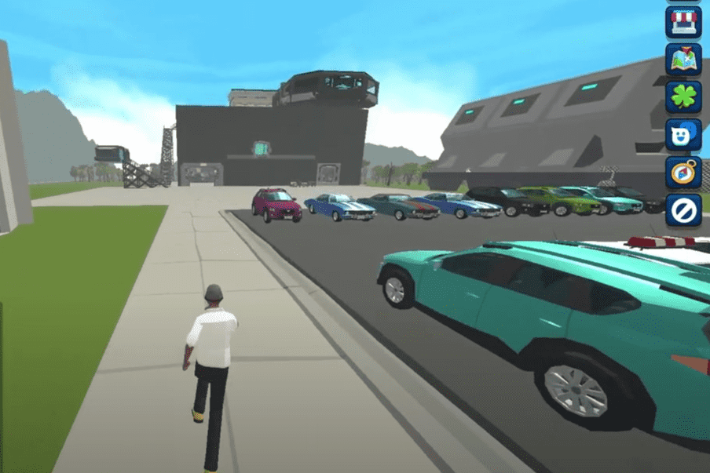

# Tranquility City

什么是静城？
Tranquility City 是一款在 Harmony 区块链上开发的游戏，人们可以在其中相互交流、玩得开心，并且显然可以进行交易。

城市中将有多个区域，每个区域都有房地产，人们可以用家具和化妆用品装饰他们的私人住宅，他们可以在市场上进行交易，并通过出租他们的房地产 NFT 获得被动收入。 还将有多个公用事业区，例如用于社区活动的 Cassiopeia 区、与 Tranquility City 合作伙伴的合同互动的金融区以及更多由开发人员/社区决定的区域。

经济将由社区驱动。 我们（团队）不会干预游戏内市场上的物品价格。 家具和其他装饰品将使用游戏内货币（项目的治理令牌 - LUMEN）购买/交易。

