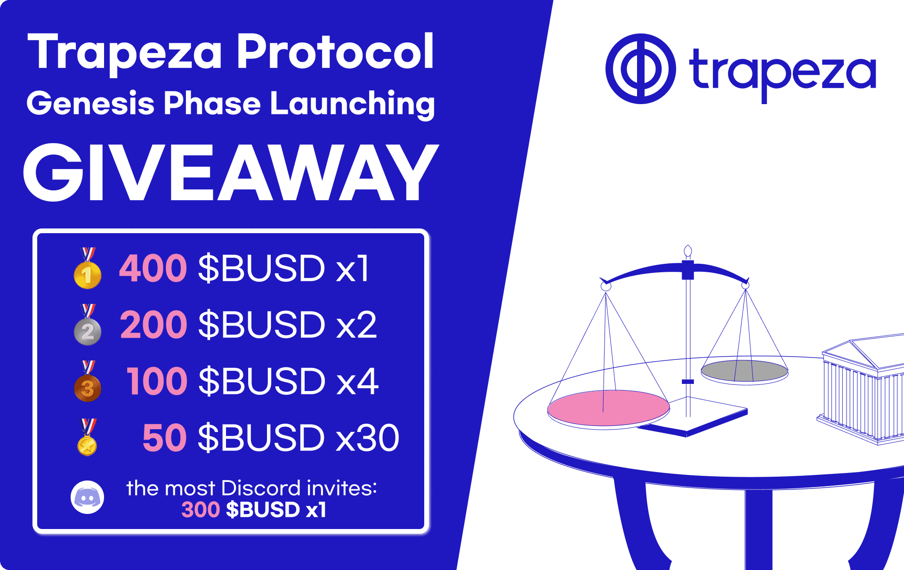

# Trapeza Protocol

什么是 Trapeza 协议？
Trapeza 是一种去中心化的储备货币协议。

Trapeza 旨在成为基于平衡增长的真正储备货币。

Trapeza 是最可靠、最公平的去中心化储备货币协议。

没有预售/私人销售，也没有白名单。 没有鲸鱼，也没有 VC/顾问来最大程度地减少对协议自然增长的伤害。

Trapeza 优先考虑基于强劲需求和具有高内在价值的稳定增长的平衡增长。

一个诚实和透明的社区项目。

为了为 Trapeza 协议打下坚实的基础，FIDL 将用于备份 Trapeza 协议中的新资产

Trapeza 保证公平发布，这意味着没有预售、白名单、鲸鱼垃圾场等。

