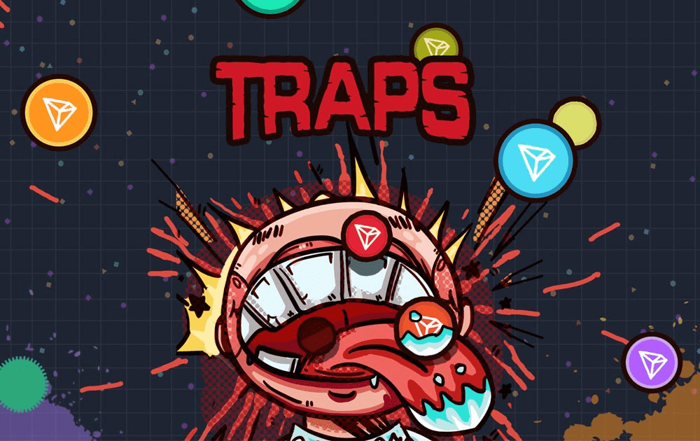

# Traps

什么是陷阱？
游戏以多人实时互动PK为设计宗旨。 通过简单易用的规则，将玩家的操作直接转化为游戏策略。 其中，头脑风暴碰撞的战斗乐趣非常令人上瘾。 在游戏中，每个人都是独一无二的星球。 大球吃小球，唯一的目标就是吞噬其他玩家的TRX。

每场比赛结束后，玩家根据他们在比赛中的排名获得、失去或保持他们的明星，排名基于排行榜中的质量。您拥有的星星越多，您的丹就越高，您将来获得更高价值房间的机会就越多。

同一段位的玩家将在同一个房间进行匹配，这将使技能水平相似的玩家之间的战斗更加公平甚至更加公平。随着玩家数量和房间数量的增加，玩家将与技能相似的玩家进行更紧密的匹配

