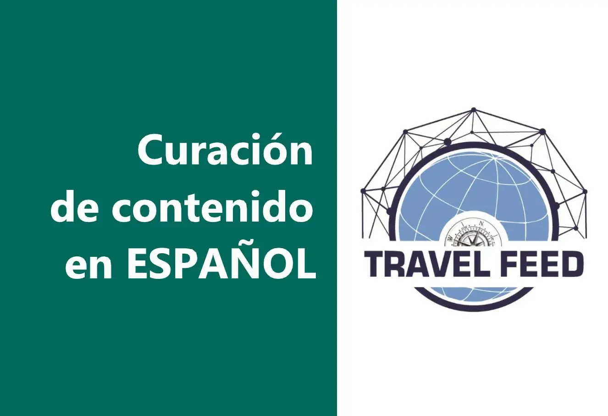

# TravelFeed

什么是 TravelFeed？
TravelFeed是独立旅行者为独立旅行者打造的社区平台。 每个用户都可以通过 Steem 区块链托管和货币化自己的免费旅游博客，并可通过他们自己的 TravelFeed 子域访问。 相同的帖子可以通过主要的 dApp 访问，这是一个无与伦比的资源，可以由我们的策展团队精心挑选的数百名旅行者发现旅行内容。 路线图上有几个社区功能。

TravelFeed 上的博客是免费的 - 不需要信用卡

使用您自己的域
在我们的可选站点构建器计划中使用您自己的域

避免冷启动
在 TravelFeed 社区中找到您的受众

为旅行者优化
自定义地图、按目的地自动分类和目的地搜索听起来如何？

制作漂亮的帖子
利用 Unsplash 照片、照片画廊、Instagram 嵌入等编辑器块

没有烦人的广告
我们不会在您的文章中显示烦人的广告，但您可以添加自己的广告和附属链接以通过您的博客获利

默认快速
TravelFeed 使用边缘缓存将您的文章超快速地提供给世界各个角落的读者

添加你的个性
您的博客可以通过我们的网站构建器完全定制 - 无需编码技能

包括 HTTPS
我们会自动为您的网站提供免费的 SSL 证书

赚取加密货币
交叉发布到 Hive 并赚取加密货币。一些博主已经赚了数千美元！

免维护
永远不要浪费时间更新插件、主题或数据库

随时随地创建帖子
使用我们的移动应用程序随时随地创建旅行故事并将其发布到您的博客

