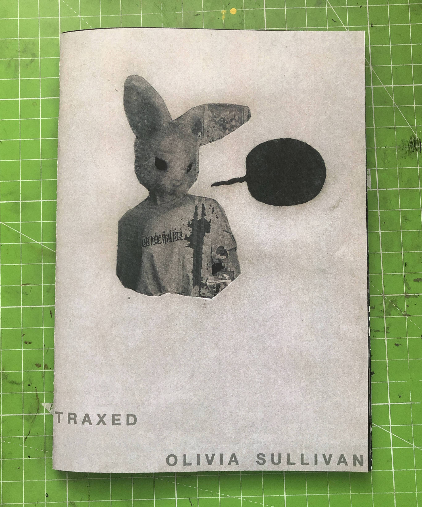

# Traxed

什么是Traxed？
在日益全球化、充满活力和高效的市场中，客户了解他们所购买产品的质量非常重要。

透明的卖家致力于让客户知道他们的产品是按照严格的指导方针制造的，包括所用组件的质量和劳动力的生活质量。

公司面临来自政府和监管机构的越来越大的压力，以确保其产品符合人权和环境标准。

公司确保其供应链清洁和合规的唯一方法是使用可公开验证的系统来证明其数据是可靠的。

使用 Traxed，公司可以通过区块链轻松证明他们及其供应商声称的内容。

