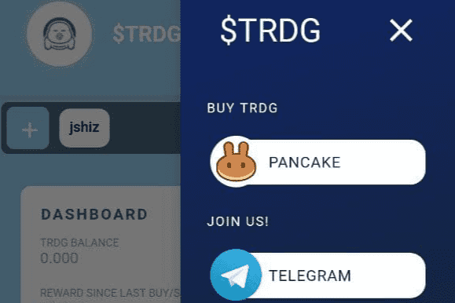

# TRDG Track

什么是 TRDG 轨道？
5% 税（2.5% 烧掉 // 2.5% 返还给持有人）

✨致所有新的缓步动物✨

那问 $TRDG 是关于什么的，我们为你写了这个！

我们是通货紧缩的代币，具有最佳燃烧和回报率之一。 您的代币价值将增加，这要归功于您仅通过拥有 $TRDG 即可获得的免费代币数量以及每笔交易的流通供应减少。

尽管有这些惊人的代币经济学，我们将围绕 Tardigrades 和我们的社区建立一个品牌，将发布一个应用程序跟踪器，以便每个人都可以随时随地跟踪他们的 $TRDG 余额和价值，我们将非常关注 为我们的持有者提供 NFT，并可能创建一个生态系统来交换它们，我们将开发与缓步动物相关的 2d/3d 游戏，如果可能的话，使用我们的代币 $TRDG 和虚拟现实。

🚀 缓步动物永远不会死 🚀

