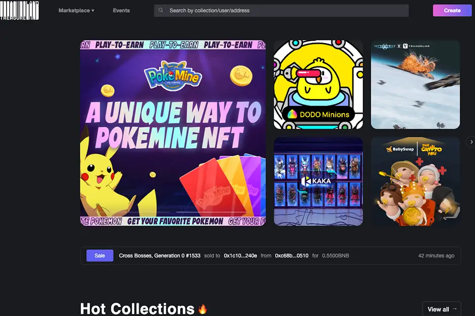

# Treasureland

Treasureland - DEGO旗下的BSC NFT市场是币安智能链上最大的NFT交易市场。它拥有完整的 NFT 生态系统，包括 NFT 铸造、挖矿、制作、拍卖、交易、交易等。
Treasureland 将用于更多的商业案例，如游戏、盲盒。它将在用户和 DeFi 程序之间架起一座桥梁。Treasureland 是一个多链 NFT 市场，允许用户铸造他们的艺术品并将其在币安智能链上出售。在收到用户对以太坊高gas费的投诉后，Treasureland 选择过渡到币安智能链（BSC）。过渡现已完成，交易费用要低得多，有利于所有用户。

Treasureland NFT 市场是 DEGO 背后的开发商的衍生产品。Dego 于 2020 年 9 月推出，是一个专注于构建跨链系统的开源协议。一些消息人士称，开发商选择保持匿名，目的是不为该项目获得任何荣誉。

