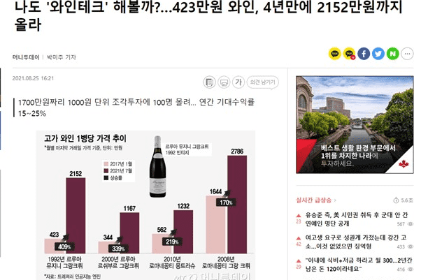

# Treasurer

司库是一个交易收藏资产的平台。在Treasurer，我们为韩国用户提供手表、葡萄酒、威士忌、体育纪念品和老爷车等蓝筹收藏品的交易平台，以实现分散所有权。用户可以在Treasurer Marketplace 与其他用户交易他们的股票，或者购买他们在收藏资产首次公开募股期间错过的股票。用户可以将他们的收藏品份额保留在 Kakao 剪辑上（服务预计将于 2021 年 12 月开始）。在这个高通胀时代的新时代，21 世纪的另类投资，财务主管

