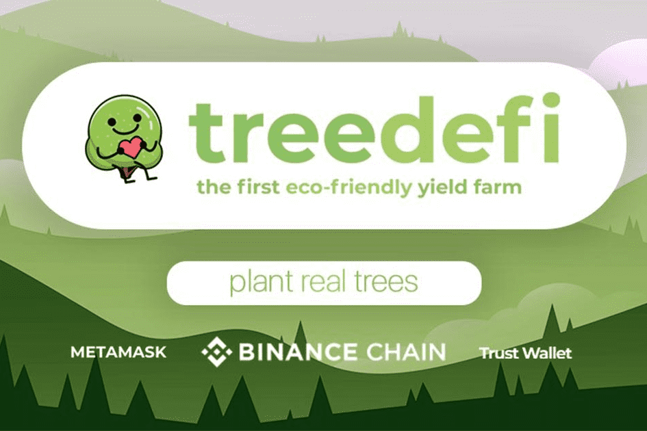

# TreeDefi

我们所做的一切都是为了一个好的事业。

TreeDefi 是一个 Yield Farming 项目，通过一个名为 TREE 的上限代币和一个名为 SEED 的无上限通缩代币，专注于通缩代币经济学。

我们平台上所有交易费用的三分之一（⅓）将用于种植现实生活中的树木。我们团队中的每个人都是大自然爱好者，看到比特币挖矿社区对环境的疏忽感到难过。我们的贡献可能不会很大，但如果我们确保您的投资安全以及我们社区和平台的繁荣，我们可以发挥重大作用。当我们在一起时，有了更大的力量。

