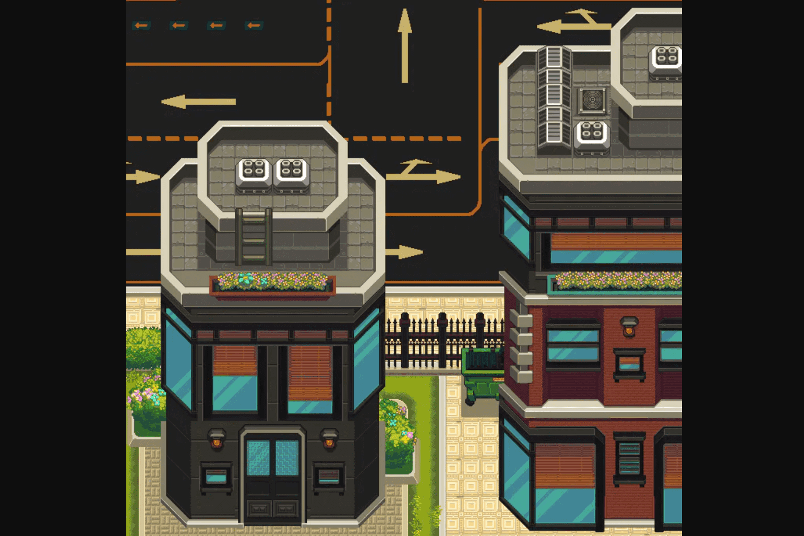

# Treeverse

Treeverse 是一款基于浏览器的 MMO。 Treeverse 致力于成为一个取代 Discord、Clubhouse 和 Twitter 等社交平台的地方，用于 NFT 聊天，同时游戏化体验。
用我们独特的 2d 像素艺术主题带回对旧口袋妖怪游戏和 Runescape 的怀旧之情。
我们在 2 月左右开始构建，并正在启动该项目的 alpha 版本。
Metaverse 是一个在这个领域被广泛讨论的概念，但每个人都有不同的含义，只有几个人履行了他们的承诺。我们已经准备好项目的 alpha 版本，这个创世 NFT 下降标志着 Treeverse 的开始。
以下是路线图上的一些内容：

  游戏内交易市场。
  宠物和NPC。
  行会。
  季节性事件。
  小游戏。
  NFT 锁定区域。
  自定义公共土地。

