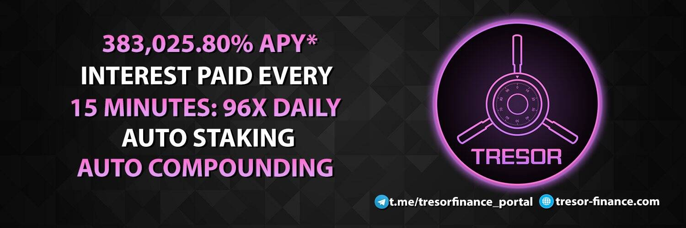

# Tresor Finance

最好的自动质押和自动复合 DEFI 3.0 协议
• 高固定APY in – 383,025.80%
• 在您的钱包中自动进行质押和复利。
• 每15 分钟支付一次利息：每天96 次！
• 每笔交易都会自动销毁供应。
Tresor Finance 授权其投资者广泛复利他们的投资，因为新的金融协议每 15 分钟奖励投资者 0.02355% 的利息，复利 APY 为 383,025.80%，只需在他们的钱包中持有 $TRESOR 代币。

如果您是加密新手，请使用 Crypto.com 大学和我们的帮助中心了解如何开始购买比特币、以太坊和其他加密货币。要以您选择的法定货币查看 Tresor Finance 的实时价格，您可以使用此页面右上角的 Crypto.com 的转换器功能。

