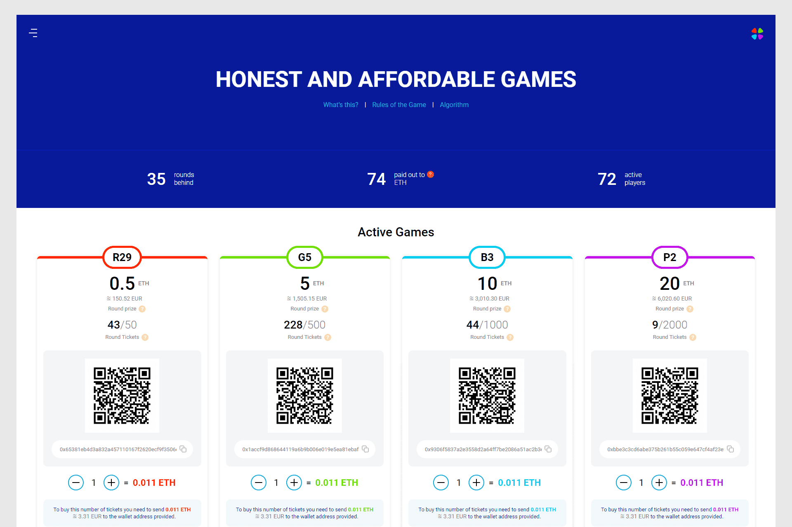

# Triangle Rooms

首先，这些是绝对所有人都可以玩的公平游戏，因为任何房间的任何一轮的门票价格仅为 0.011 ETH
与各种彩票、老虎机、赌场和其他机会游戏不同，组织者可以根据需要轻松选择获胜者，Trainglerooms.io 是一个完全排除干扰确定获胜者算法的可能性的系统，并致力于去中心化智能合约的基础。
有4个游戏室：红绿蓝紫。房间的票数各不相同，因此获胜者将获得的奖品金额（获胜票）。
我们项目的目的和目标是让人们变得更富有，同时最大限度地提高他们的匿名性。
Trianglerooms - 是三角形，每个成员都是系统的一部分，让人们每天都变得更富有！

