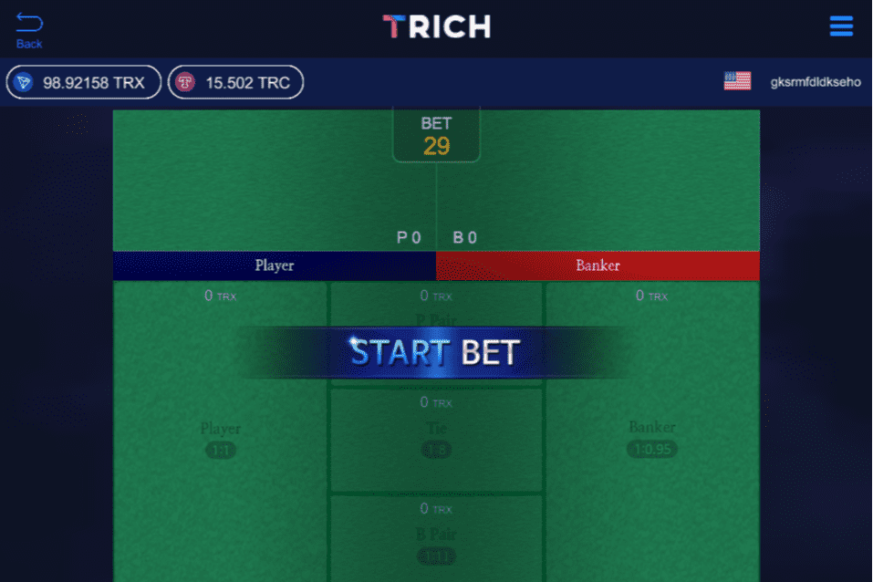

# Trich

Trich 是一款基于 TRON 的去中心化游戏，在区块链上执行所有动作。通过智能合约，所有结果都是在区块链中随机生成的，任何结果都可以直接通过哈希值进行验证。 Trich 通过其技术只提供透明和公平的游戏。完美的赌博，TRICH，DAppChain 是波场 TRON 的侧链项目。目标是帮助 DApp 以更低的能耗、更快的速度和更高的安全性在 TRON 上运行，为 TRON 的主网络提供无限的容量。----完美的赌博 - TRICH

Tron 是一个基于区块链的去中心化平台，旨在通过分布式存储技术构建一个免费的全球数字内容娱乐系统，并允许轻松且经济高效地共享数字内容。

Tron 由一家名为 Tron Foundation 的新加坡非营利组织于 2017 年 9 月创立。 它由首席执行官孙宇晨 (Justin Sun) 领导，拥有一支专门的内部开发团队，其中包括著名的技术支持者。 本文探讨了 Tron 网络、其工作原理及其加密货币 Tronix (TRX)。

Tron 清楚地勾勒出带有日期标记的里程碑的长期愿景，并且数字内容的日益普及以及低成本的承诺使其成为区块链领域的一项有前途的努力。 它的前景也得到了富有而成熟的中国投资者的坚实支持。随着马云领导的阿里巴巴集团的许多开发人员于 2017 年底加入 Tron 的开发团队，有传言称 Tron 和阿里巴巴之间可能正在建立合作伙伴关系。

