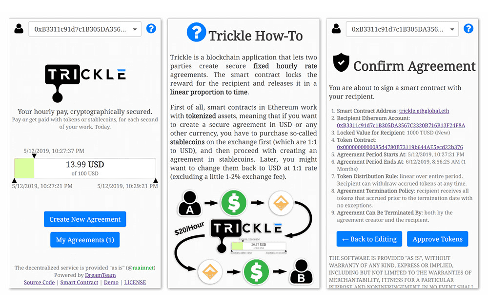

# Trickle

Trickle 是一个区块链应用程序，可让两方创建安全的固定小时费率协议。智能合约为接收者锁定奖励，并按时间线性比例释放。 Trickle 适用于以太坊网络之上的任何稳定币或 ERC20 兼容的代币。 Trickle 实现了有史以来最透明的财务关系：智能合约锁定接收者的奖励，并按时间线性比例释放。因此，雇主和雇员都是安全的；从雇主的角度来看，他们几乎没有遇到不良员工的风险，因为他们可以随时取消协议。从员工的角度来看，他们每工作一秒钟就得到报酬，智能合约保证他们的余额随时间累积的价值是他们的，无一例外。

