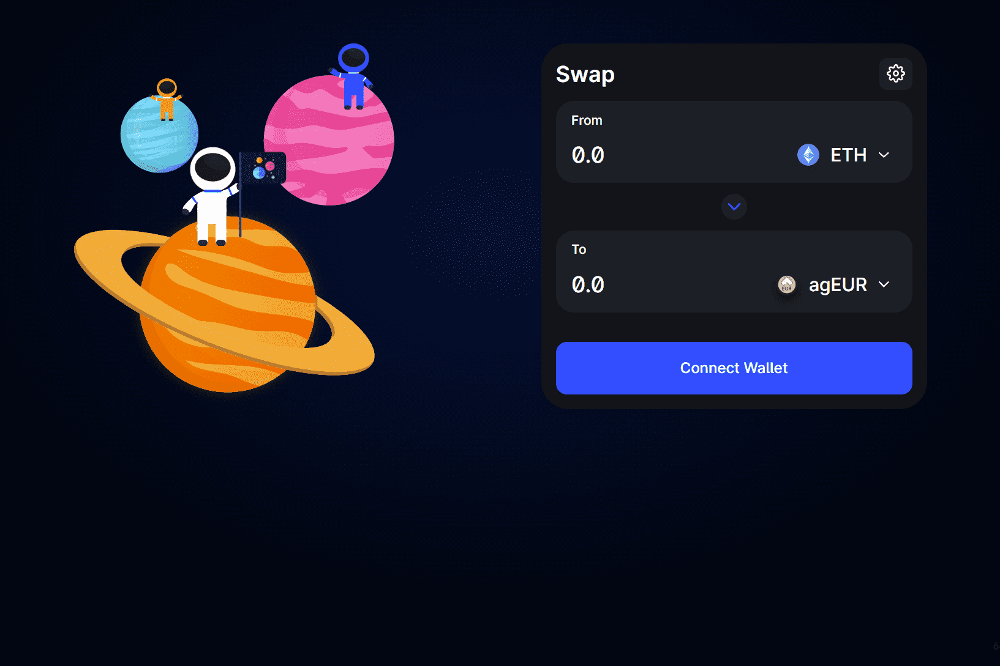

# Trisolaris

Trisolaris 在 Aurora 引擎上是排名第一的 Dex，Aurora 引擎是在 Near 生态系统中运行的与 EVM 兼容的区块链。
特征

  简单直观的用户界面
  高速交易和微不足道的费用
  提供流动性和交换任何 ERC20 的能力
  流动性挖矿激励措施（稍后会详细介绍）

我们很高兴地宣布我们的最新合作伙伴：Axelar — 为 Web3 提供安全跨链通信的通用覆盖网络。

使用 Axelar，持有 AURORA、NEAR 或 USN 的用户将能够使用这些货币来买卖资产，例如 ETH、AVAX、DOT 或任何其他在 Axelar 支持的链上发行的资产。

该合作伙伴关系将利用 Squid，这是一个流动性路由模块，可在 Axelar 上实现跨链交换和支付，这标志着 Aurora 用户和更广泛的 NEAR 社区的体验向前迈出了一大步。 Squid 将通过 Axelar 提供去信任的流动性和消息路由，允许 Trisolaris 的用户在任何链上的任何 DeFi 应用程序上插入和使用流动性。

Ad-hoc 跨链连接可以通过使用成对的桥接来访问，但是在通用架构上实现安全的跨链通信使该技术远远超出了当前状态。 Axelar 的基础设施具有巨大的去中心化交易所潜力，而这项技术有可能使 Trisolaris 更接近实现主流采用。

据说这种集成将在今年晚些时候上线，我们将更新社区的具体细节！

