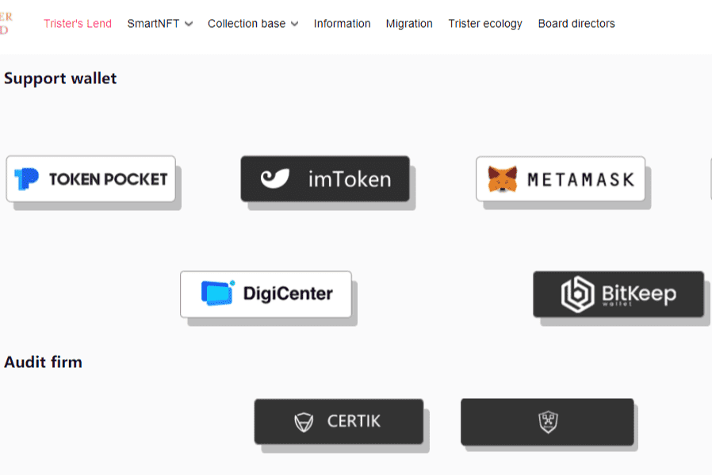

# Trister's World

Trister's Lend是Trister World的第一个生态应用，其中还包括Swap、Vault、Insure、Oracle、NFTBase、Mirror、DAO等一系列矩阵应用和金融衍生品。 Trister's Lend 是 Trister World 首个针对 HECO 生态链的去中心化开放借贷协议平台。
它起源于 Trister 社区，提供社区成员之间的财务交流。该协议基于智能合约技术和资金供需，可以在 Trister 社区成员之间快速智能地实现融资协议。
在 Trister 的 Lend 协议中，用户可以完全控制资金并拥有自己的资金。用户可以轻松访问去中心化网络。

