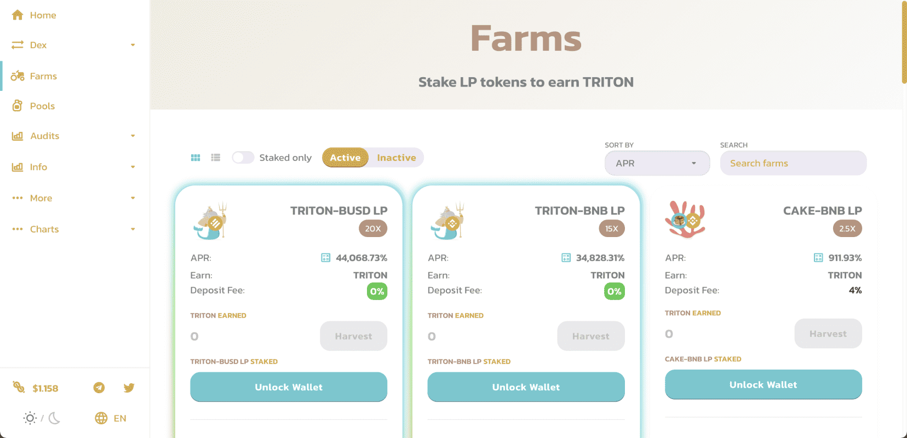

# Triton Farm

Triton 是一个去中心化投资平台，由币安智能链区块链提供支持，由 Triton 去中心化自治组织 (DAO) 管理。

Triton Foodwork 的产品在温度和湿度受控的温室中种植，采用专有的水培和垂直耕作系统，以生态可持续的方式种植。该公司在系统和流程上进行了大量投资，使其能够建造和管理超过 150,000 平方英尺的最先进的垂直农场。

Triton Foodworks 为其零售、机构和餐厅客户提供可靠、负责任和一致的农产品供应。Triton Foodworks 认为，印度农业面临的问题需要通过非常规的解决方案来解决。我们提供这些解决方案。

受到所有成功与失败、成就和失败的启发，该公司已着手在该国其他地区扩张，以创建一个代表清洁种植、负责任的农业和可靠的农产品供应的品牌。

