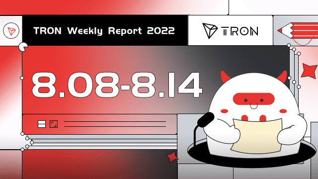

# TROMO3D

TROMO3D 是对加密货币 ICO 领域的一次讽刺性攻击，让每个玩家都处于可怕和诱人的境地，以退出骗局并带着大量真实的 TRX 逃跑。你应该接受它。受到 Team JUST 在以太坊上最初作为 100% 去信任的智能合约库的 FOMO3D 的启发。 TROMO3D 的设计目的是使开发人员无法获得资金或对轮次产生影响。游戏完全基于人类的贪婪，每个人都从中获利。来玩底池或获得与您持有的钥匙数量成比例的无限红利！

TROMO3D 是一个基于 TRON 的平台。它是臭名昭著的 Fomo3D 游戏的克隆。 TROMO3D 让您成为游戏中的 ICO 持有者，并诱使您退出，骗取您的投资者。您可以最终赢得大奖，或获得持续的股息支付。游戏是去中心化的。

