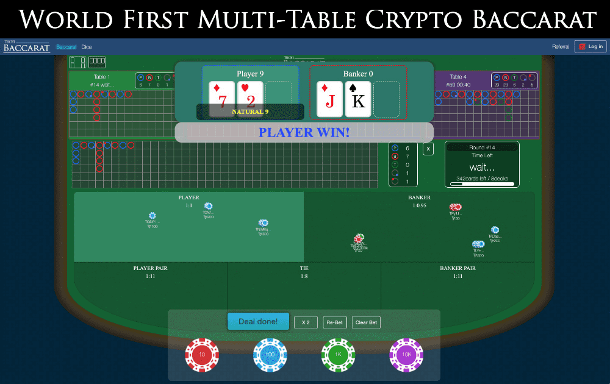

# Tron Baccarat

♠♡♣？世界首创的多桌加密百家乐？ ♠♡♣

关于百家乐的起源有多种说法，下面是传说中的一种：该游戏是由一个叫Felix Falguierein的中年意大利赌徒发明的。最早是使用一幅占卜用的[纸牌]（Tarot）。

依据古老的伊特鲁里亚人宗教仪式中的九位神，他们向一位金发处女祈祷，诚心希望她掷出一颗九面色子。掷出[色子]的结果决定了她的命运。如果掷出8点或9点，她将成为[女祭司]；如果结果是6点或7点，她将被禁止参加任何宗教活动；如果点数小于6点，她将必须走入大海。

