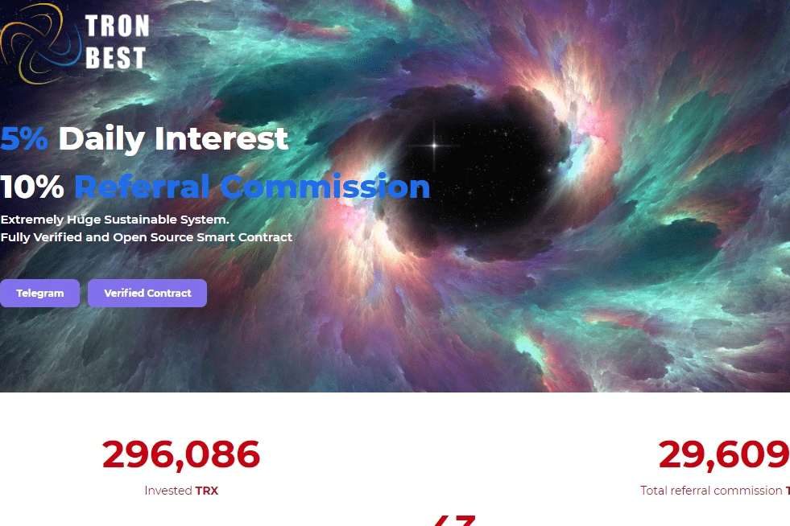

# TRON BEST

50TRX ($0.18) 最低投资
4 级 10% 推荐奖金
每天 5% 的投资回报率。退出时再投资 25%。
推荐佣金将用于您的押金以实现巨大的可持续性！！！由于其独特的功能，预计会击败其他人

自 2017 年推出市场以来，Tron 迅速崛起，成为加密领域最受欢迎的公链之一。作为专注于提供娱乐的领先去中心化数字平台，Tron 由其原生代币 Tronix (TRX) 提供支持，为网络上的各种交易提供动力。

TRX 定位于保持顶级加密货币的地位，特别是由于其卓越的技术规格允许快速和廉价的点对点在线支付。在在线或硬件钱包中持有 TRX 代币不仅可以帮助您在不同平台上快速交易，还可以让您访问旨在分散网络的产品。

经过深入研究和综合分析，我们编制了最好的 Tron 钱包指南，为您提供有关 TRX 存储位置的可靠信息。

让我们开始探索 TRX 存储和管理的不同方面。

