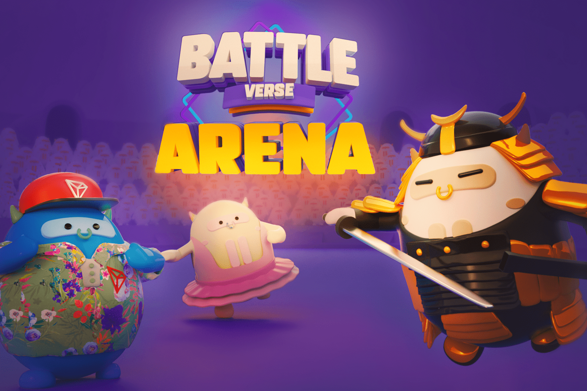

# Tron Bull Club

Tron Bulls 正在接管 Tron。这是他们的地盘，他们会为之而战。只有 15,012 只 Tron Bulls，每只都具有不同的外观和能力。为战斗诗句竞技场做好准备！从时髦的武士到间隔开的学员，这些 Tron Bulls 风格各异。但是不要被他们可爱的外表所迷惑，这些坏男孩的能力将使他们在 Tron 宇宙中脱颖而出。
每个美学特征在集合中的所有 NFT 中都有一个分配比例。有些特质会比其他特质少得多。你们都知道这是如何工作的。特性越稀有越好。您将能够在 ApexGo.io 上验证特征稀有度。
游戏特征由一个范围从 4 到 10 的数值组成。数字越高，NFT 的能力越强。敏捷性为 10 的 NFT 在游戏过程中将比能力为 4 的 NFT 快得多。我们还在我们的特征中加入了变量，以获得我们的通用特征中未包含的特殊能力和能力。示例：游戏可以使用由变量 1 决定的不可见特征。对于某些游戏，这可能是决定性特征。
一个完整的虚拟世界成为现实只是时间问题。特隆会在那里。

 Tron Bulls 也将如此。当然，让我们一次只做一件事。加入我们的社区，成为旅程的一部分。我们的第一个目的地是 BattleVerse Arena。准备好你的 Tron Bulls！
