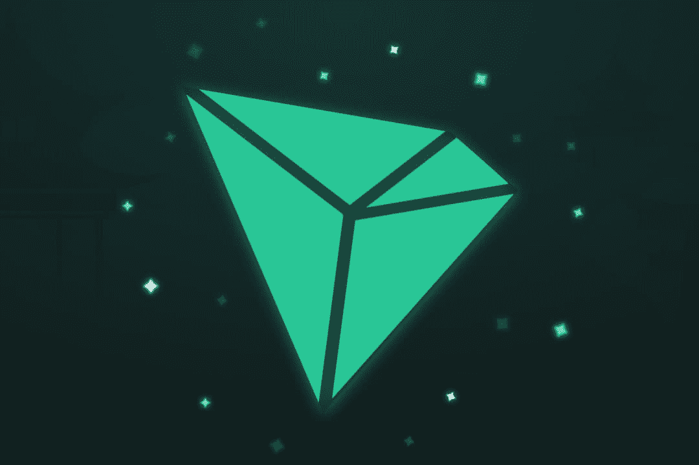

# Tron Chain Systems

TRON Chain 是一个完全去中心化的社区驱动的基金会。 P2P支持模式是任何成也就都是社区成员工作的结果。这不提供保证，也不会产生额外的利润。作为社区的一员，您可以支持他人，其他成员也支持您。TRON 协议是...十亿交易中最大的基于区块链的操作系统之一，TRON 是世界上增长最快的公共链。TRON Chain 是一个完全去中心化的社区驱动的基金会。 P2P支持模式是任何成就都是社区成员工作的结果。

