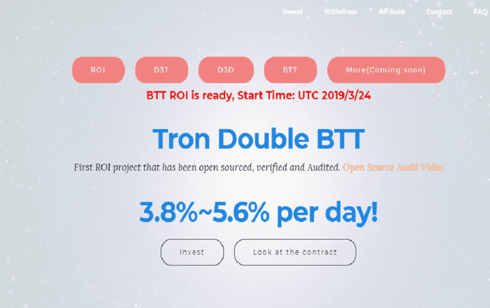

# Tron Double - BTT

Tron Double BTT 每天 3.8%~5.6% 多种投资计划，开源、验证和审计 三层附属：5%-2%-1% - 每天获得 3.8% 的收益，持续 50 天 - 每天获得 4.0% 的收益，持续 40 天- 每天获得 4.4% 的收益，持续 30 天 - 每天获得 5.6% 的收益，持续 20 天介绍 TwoFold — TRON 存款的双 BTT 空投活动...... Koinex 上所有 TRX hodlers 的双空投活动接收 2X......短时间内，BTT 大量流入，价格几乎翻了一番。尽管略有下降，但该资产已成功保持在关键...我们将在 3 月 11 日 00:00 UTC 启动我们的第二次 $BTT 空投并奖励 TRON $TRX 持有者 990,000,000 #BTT！这里有你需要知道的一切......

