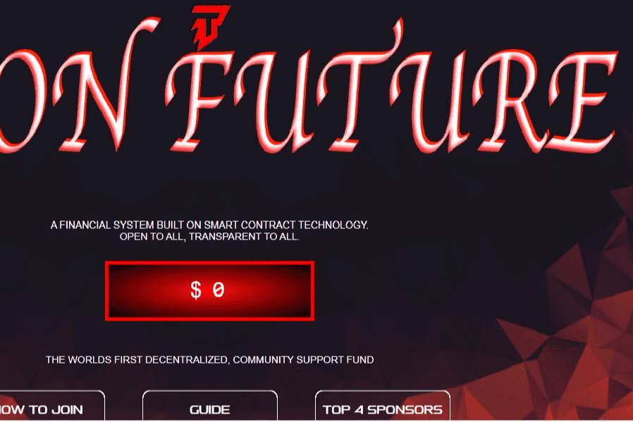

# Tron Future

您可以通过向基金存入至少 500 TRX 来参与 TRON FUTURE。
310% 有 4 种方式返还（1 种被动方式和 3 种通过营销方式），当通过 4 种方式中的任何一种方式累积 310% 时，必须重新存入相等或更高的存款才能继续从基金中收取。

经过多年对 TRON 价格的分析，加密专家准备提供他们对 2030 年的 TRX 成本估算。它将以至少 1.56 美元的价格交易，其中...TRON (TRX) 未来 10 年到 2030 年的价格预测 ✓ 历史价格......这次收购让 TRON 在公司的未来计划中发挥了重要作用。

