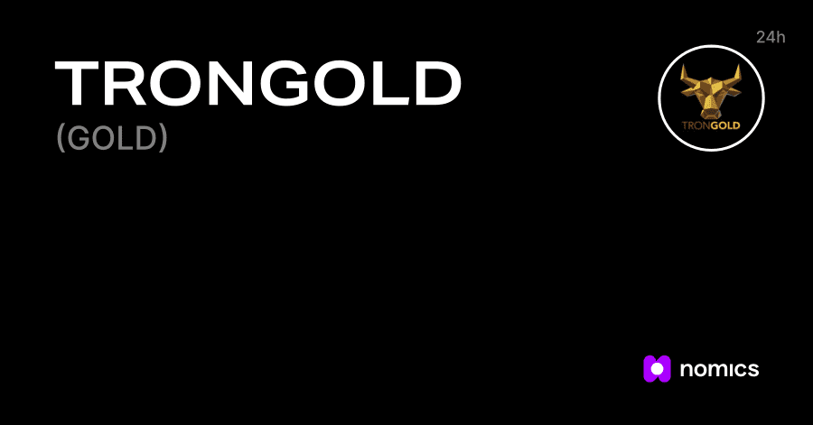

# Tron Gold

Tron Gold 是一个以社区为基础的支持性基金，旨在为所有社区成员提供可持续的财务援助。该基金基于 100% 透明和去中心化的智能合约运行。让我们从“1 克”黄金开始购买吧！ 24小时在线交易。香港认可的999.9和99“永丰”牌金条金精炼厂。
任何参与者都可以向社区基金贡献 TRX，以获得 333% 的回报。Etherscan 上的 Tron Gold (TRG) 代币跟踪器显示代币的价格 0.00 美元，总供应量 10000000000，持有者数量 2 和更新的信息......Tron Gold (TRG) 代币信息和跟踪器。 TRG 硬币的总供应量为 10000000000。3 笔交易和 2 名持有者。

