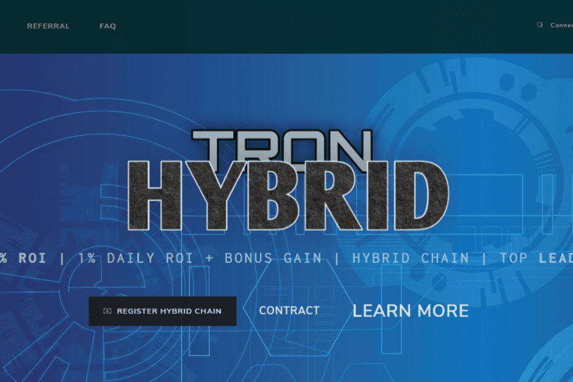

# Tron Hybrid

通过我们的智能合约（更智能），我们建立了一个独特的合约、更强大的混合和完全可持续的投资结构，允许任何人通过 Matriz 链和奖金将他们的潜在 Tron 翻倍以获得更大的利润。 <strong>300% 的投资回报率</strong>！Michael Saylor 的投资机构的公司最新的购买条款大约是 43663 的平均首席执行官 ... 该公司表示，正在其 Powerplantcryrency Mining Hybrid 设施进行全面碳性 ...那个美国的零售投资者，同时，这来自于一个副国家安全顾问......就在这个星期天，美国宣布加密货币加密公司后，太阳宣布将所有注记加密，因为在美国，因为国家在加密货币认可方面的进展。 ...

